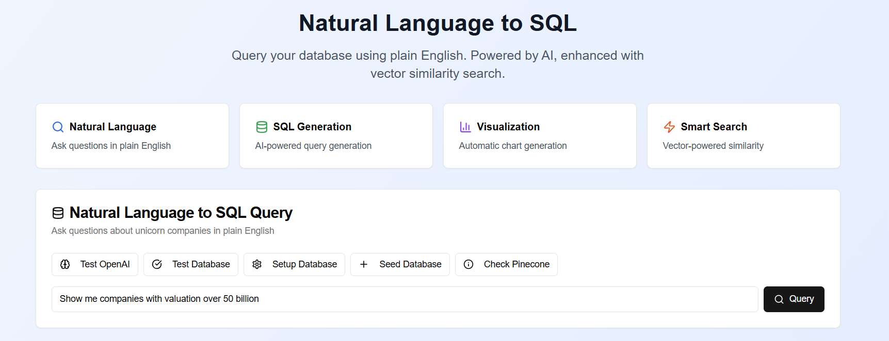
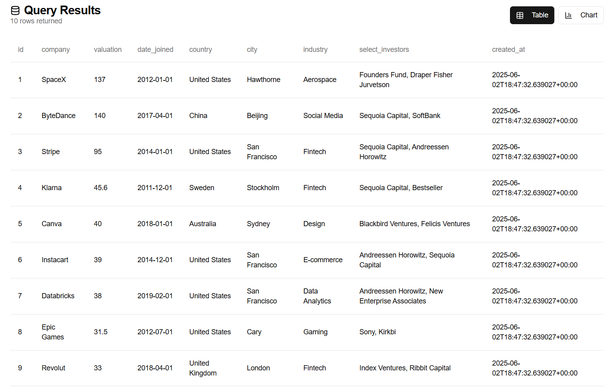

<!-- Add badges here (e.g., build status, license) -->

# SageQuery

## Overview

SageQuery is a production-ready, modular, full-stack application for translating natural language to SQL, powered by advanced RAG (Retrieval-Augmented Generation) and semantic search. It features a FastAPI backend, React + Tailwind frontend, vector search with Pinecone/pgvector, and OpenAI integration for embeddings and GPT-4o.

## Deployed Images

Below are visual examples demonstrating the key features of the project:

#### Query Interface

> Enter natural language queries and see how they're translated to SQL in real-time.

#### SQL Output Preview

> View the auto-generated SQL query with options to copy or execute it.

## Features

-   Natural Language → SQL translation (GPT-4o)
-   Schema discovery and secure SQL execution
-   RAG with LangChain and semantic retrieval
-   Example grounding from `Sharathhebbar24/sql-create-context` dataset
-   Modular, secure, and production-ready
-   React + Tailwind UI: query input, SQL preview, results, history, feedback
-   REST API backend
-   Docker Compose for full stack deployment

## Tech Stack

-   **Backend:** FastAPI, LangChain, SQLAlchemy, Pinecone/pgvector
-   **Frontend:** React, TailwindCSS
-   **Embeddings:** OpenAI `text-embedding-3-small`
-   **Vector DB:** Pinecone or pgvector

## Installation Instructions

1.  Copy `.env.template` to `.env` and fill in your keys.
2.  Run `docker-compose up --build` to start the stack.
3.  Access the frontend at `http://localhost:3000` and backend at `http://localhost:8000/docs`.
4. Access deployed on Vercel

## Usage

-   Enter a natural language query.
-   Preview the generated SQL.
-   Execute and view results.
-   Review query history and provide feedback.

## Configuration

Explain how to configure environment variables or settings by detailing the contents of the `.env` file and any other relevant configuration locations. (Requires examining `.env.template` and potentially other config files in `backend` and `frontend`).

## API Reference

Document key API endpoints, their purpose, request/response formats, and any necessary authentication. (Requires examining files in the `backend/api` directory).

## File Structure

```
SageQuery/
  backend/
    api/
    db/
    langchain_modules/
    services/
    utils/
    tests/
  embeddings/
  vector_db/
  frontend/
    src/
      components/
      pages/
      services/
      utils/
      context/
    public/
  tests/
    e2e/
  scripts/
  docs/
  .github/
    workflows/
```

## Contributing

-   Fork and PRs welcome!

## License

MIT

## Credits

Acknowledge any external libraries, datasets, or significant contributors not already mentioned. 
